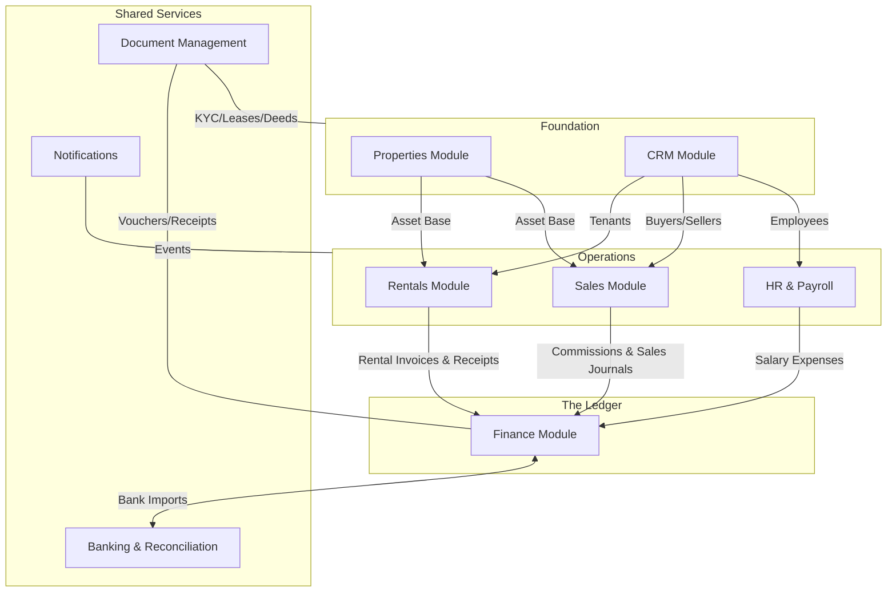

# Stohill ERP - Module Architecture & Relationships

Stohill ERP is built on a **Modular Core** architecture where business-specific units (Rentals, Sales, HR) are orchestrated by two foundational pillars: **Properties** (Inventory) and **Finance** (Ledger).

## 📊 High-Level Entity Relationship Diagram

## 🛠️ Module Breakdown & Interactions

### 1. Finance (The Heart)
The Finance module acts as the "General Ledger" for all ERP activities.
- **Accounts Receivable (AR)**: Receives rental invoices from `Rentals` and commission invoices from `Sales`.
- **Accounts Payable (AP)**: Receives maintenance costs from `Rentals` and salary obligations from `Payroll`.
- **Relationship**: Every lifecycle event (a signed lease, a sold house, a paid salary) culminates in a `JournalEntry` within this module to ensure GAAP compliance.

### 2. Properties (The Inventory)
This is the physical asset registry.
- **Relationship**: A property record starts in `Properties`. When it is listed for rent, it is picked up by `Rentals`. When it is sold, the `Sales` module manages the transaction. Its status transitions (Available → Listed → Occupied → Sold) are tracked across all modules.

### 3. CRM (The Stakeholders)
A centralized database for all people and organizations.
- **Contacts**: Specialized via `contact_type` (Tenant, Buyer, Supplier, Lead).
- **Leads/Opportunities**: Tracks interest in specific from `Properties`.
- **Relationship**: `Rentals` looks up tenants here, and `Sales` looks up buyers. This prevents data duplication and provides a "360-degree view" of a client's history with the firm.

### 4. Rentals & Management
Handles the operational lifecycle of a lease.
- **Relationship**: Uses `Properties` for inventory, `CRM` for tenants, and `Finance` for monthly billing. It also interacts with `Banking` to automatically reconcile rent payments from bank statements.

### 5. Sales & Pipeline
Manages the visual Kanban pipeline for property transactions.
- **Relationship**: Integrates with `Commissions` to calculate agent earnings and `Finance` to post the final registration journals.

### 6. Shared Services (Documents & Notifications)
- **Documents**: Provides a secure upload vault. Every `Lease` or `Sale` is linked to physical PDF agreements stored here.
- **Notifications**: Listens to events (e.g., "Invoice Overdue" in `Rentals`) and alerts relevant agents or accountants.

---

### 💡 Architectural Principle: "Single Source of Truth"
*   **A Property** is only created once.
*   **A Person** is only created once.
*   **A Financial Transaction** is only posted once, but may be "mirrored" (e.g., a Rental Invoice creates a Finance AR Invoice automatically).
